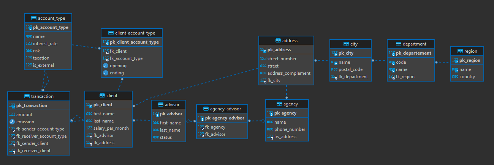
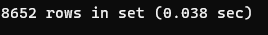
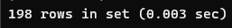
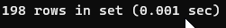

# Ma (première) DB
## Groupe
- Groupe G1-7
  - Arnaud BOYER
  - Clément LAFON
  - Clément LO-CASCIO

## Fichiers
- Dump de la base: dump.zip
- Faker generator: main.py
- SQL DB generator: SQL Simon Banque.sql

<br>

# Table des matières

- [Ma (première) DB](#ma--premi-re--db)
  * [Groupe](#groupe)
  * [Fichiers](#fichiers)
- [Table des matières](#table-des-mati-res)
  * [But](#but)
    + [Contrainte et Remarque](#contrainte-et-remarque)
    + [Optimisation BDD](#optimisation-bdd)
    + [ERD](#erd)
  * [Indexes](#indexes)
    + [1 - Client Account Type: opening](#1---client-account-type--opening)
    + [2 - Advisor: status](#2---advisor--status)
    + [3 - Transaction: emission](#3---transaction--emission)
  * [Vues](#vues)
    + [1 - Comptes client](#1---comptes-client)
    + [2 - Gains d'un client sur 12 mois](#2---gains-d-un-client-sur-12-mois)
    + [3 - Montants intérets des placements d'un client](#3---montants-int-rets-des-placements-d-un-client)
    + [4 - Découvert compte client](#4---d-couvert-compte-client)
    + [5 - Montant des agios](#5---montant-des-agios)

<small><i><a href='http://ecotrust-canada.github.io/markdown-toc/'>Table of contents generated with markdown-toc</a></i></small>


<br>


## But

Notre base représente une structure de banque simplifiée.

### Contrainte et Remarque
Lors de la conception de notre base, nous avons décidé d'appliquer une convention de nommage pour toutes nos clés
(primaires (pk_nom_table) et étrangères (fk_nom_table_cible)).

De plus, contrairement à la version 1 du projet, nous avons intégré un minimum d'intelligence dans notre base et seeder. 

Exemple:

1. Lors d'une transaction ayant pour émetteur et receveur le même compte client. Nous parlons de transaction interne.
Seul les types de comptes non externe peuvent effectuer ce type de transaction.

2.  Lors d'une transaction ayant un émetteur et receveur différent. Nous parlons de transaction externe. Disponible seulement avec un compte joint.

*A noter que ces fonctionnalités, ne sont disponible que dans le seeder python. Mais nous pourrions les  mettre en place avec des curseur sur notre base de donnée.*

### Optimisation BDD
Nous avons préféré rajouter un certain nombre de procédures stockées en passant en paramètre, l'id du client.
Plutôt que d'écrire une vue effectuant le même calcul pour tous nos clients et ensuite filtrer sur le client de notre choix.

<br>

### ERD


<br>

## Indexes

### 1 - Client Account Type: opening

Afin de pouvoir trier la table par date d'ouverture d'un crédit plus rapidement lors de calculs de temps.

```sql
SELECT opening  FROM client_account_type group by fk_client;
```


```sql
CREATE INDEX client_account_type_opening_IDX ON simon_sql.client_account_type (opening);
```
```sql
SELECT opening  FROM client_account_type group by fk_client;
```


### 2 - Advisor: status

Afin de pouvoir trier la table par états des employées. Pour retrouver plus rapidement les employées en service ou ceux en vacances par exemple.

```sql
SELECT 
	status
FROM advisor
	inner join agency_advisor ON advisor.pk_advisor = agency_advisor.fk_advisor 
GROUP BY agency_advisor.fk_agency ;
```


```sql
CREATE INDEX advisor_status_IDX ON simon_sql.advisor (status);
```

```sql
SELECT 
	status
FROM advisor
	inner join agency_advisor ON advisor.pk_advisor = agency_advisor.fk_advisor 
GROUP BY agency_advisor.fk_agency ;
```


### 3 - Transaction: emission

Afin de pouvoir chercher plus rapidement les dates d'émission lors de transactions inter-bancaires et interne.

```sql
SELECT 
	emission
FROM transaction
	inner join client ON transaction.fk_sender_client  = client.pk_client  
GROUP BY client.pk_client ;
```


```sql
CREATE INDEX transaction_emission_IDX ON simon_sql.transaction (emission);
```

```sql
SELECT 
	emission
FROM transaction
	inner join client ON transaction.fk_sender_client  = client.pk_client  
GROUP BY client.pk_client ;
```


<br>

## Vues 

### 1 - Comptes client

  * Retourne le solde des comptes d'un client et le type de compte associée

```sql
CREATE VIEW clientaccounts
AS
  SELECT 
	  CONCAT(client.first_name , ' ', client.last_name),
	  account_type.name as 'Account Name',
	  sum(amount) as 'Balance',
	  DATE_FORMAT(LAST_DAY(transaction.emission), "%Y-%m-%d") as 'On'
  FROM transaction
      inner join account_type ON account_type.pk_account_type = transaction.fk_sender_account_type 
      inner join client ON client.pk_client  = transaction.fk_sender_client 
  GROUP BY YEAR(emission), MONTH (emission), fk_sender_client
  ORDER BY emission DESC;

SELECT * FROM clientaccounts LIMIT 200;
```

* Procédure qui permet de retourner le solde d un compte 
```sql
DROP PROCEDURE IF EXISTS get_balance_account;

CREATE PROCEDURE `simon_sql`.`get_balance_account`(IN id_client INT)
BEGIN
	DROP TEMPORARY TABLE IF EXISTS temp_get_balance_account;
	
	CREATE TEMPORARY TABLE temp_get_balance_account
	SELECT
		account_type.pk_account_type,
		sum(amount) as 'Balance', 
		DATE_FORMAT(LAST_DAY(transaction.emission), "%Y-%m-%d") as 'On'
	FROM `transaction` 
		inner join account_type ON account_type.pk_account_type = transaction.fk_sender_account_type 
	WHERE fk_sender_client = id_client 
	GROUP BY YEAR(emission), MONTH (emission);
END
```


### 2 - Gains d'un client sur 12 mois

  * Vue qui permet d'obtenir tous les gains d'un client sur 12 mois.

```sql
CREATE VIEW earning_of_client
AS
SELECT 
	CONCAT(receiver.first_name, ' ', receiver.last_name) as 'Receive',
	CONCAT(sender.first_name, ' ', sender.last_name) as 'From',
	CONCAT(transaction.amount, ' €') as 'Amount',
	DATE_FORMAT(transaction.emission , "%d/%m/%Y") as 'on' 
FROM `transaction`
	inner join client as sender ON transaction.fk_sender_client = sender.pk_client 
	inner join client as receiver ON transaction.fk_receiver_client  = receiver.pk_client 
WHERE sender.pk_client = 7852 and transaction.amount > 0 and transaction.emission BETWEEN DATE_SUB(CURDATE(), INTERVAL 1 YEAR) AND CURDATE()
ORDER BY emission DESC;

SELECT * FROM earning_of_client LIMIT 200;
```


### 3 - Montants intérets des placements d'un client

 * Vue qui permet de retourner le montant des intérets du placement d'un client au cours de sa durée de vie

```sql
CREATE VIEW savings_clients
AS
SELECT 
	CONCAT(client.first_name, ' ', client.last_name) as 'Who',
	SUM(amount) as 'Saves',
	((SUM(amount) * account_type.interest_rate) / 100) as 'Bank Interest',
	(SUM(amount) + ((SUM(amount) * account_type.interest_rate) / 100)) as 'New Balance',
	t.emission as 'On'
FROM `transaction` t 
	inner join account_type ON t.fk_receiver_account_type = account_type.pk_account_type 
	inner join client on t.fk_receiver_client = client.pk_client 
WHERE t.fk_receiver_account_type = 3 and t.fk_receiver_client = 7123 
GROUP BY YEAR(t.emission), MONTH (t.emission)
ORDER BY t.emission DESC;

SELECT * FROM savings_clients LIMIT 200;
```


### 4 - Découvert compte client

 * Procédure qui permet de déterminer si le compte est à découvert depuis plus de 3 mois

[Plus d'info](https://www.service-public.fr/particuliers/vosdroits/F31423)

```sql
DROP PROCEDURE IF EXISTS check_open_a_consumer_loan;
    
CREATE PROCEDURE check_open_a_consumer_loan(IN id_client INTEGER, IN end_date VARCHAR(25), INOUT open_a_consumer_credit BOOLEAN)
BEGIN
  DECLARE is_done INTEGER DEFAULT 0;
  DECLARE c_balance DECIMAL(8,2);
 
  DECLARE c_counter INTEGER DEFAULT 0;
 
  -- déclare le curseur
  DECLARE account_cursor CURSOR FOR
    SELECT temp_get_balance_account.Balance FROM temp_get_balance_account inner join account_type ON account_type.pk_account_type = temp_get_balance_account.pk_account_type where account_type.name LIKE 'Compte Bancaire%' AND temp_get_balance_account.On BETWEEN DATE_SUB(end_date, INTERVAL 3 MONTH) AND end_date;

  DECLARE CONTINUE HANDLER FOR NOT FOUND SET is_done = 1;
  
  -- ouvre le curseur
  OPEN account_cursor;

  get_list: LOOP
  FETCH account_cursor INTO c_balance;
 
  IF is_done = 1 THEN
  LEAVE get_list;
  END IF;
 
  IF c_balance < 0 THEN
  SET c_counter = c_counter + 1;
  END IF;
  END LOOP get_list;
  -- ferme le curseur
  CLOSE account_cursor;
 
  IF c_counter >= 3 THEN
  SET open_a_consumer_credit = open_a_consumer_credit + 1;
  END IF;
  SET open_a_consumer_credit = open_a_consumer_credit + 0;
END 
```


### 5 - Montant des agios

Vue permettant de calculer le montant des agios d'un client

* Formule: montant du découvert X nombre de jours X TAEG / 365

[Plus d'info](https://www.service-public.fr/particuliers/vosdroits/F31423)

```sql
CREATE VIEW agiosAmount
AS
SELECT 
	ROUND((SUM(amount) * DATEDIFF(LAST_DAY(emission), emission) * 21.16 / 365), 2),
	transaction.*
FROM `transaction` 
	inner join account_type ON transaction.fk_sender_account_type = account_type.pk_account_type 
where account_type.name LIKE 'Compte Bancaire%' AND transaction.amount < 0 and transaction.emission  BETWEEN DATE_SUB(CURDATE(), INTERVAL 3 MONTH) AND CURDATE()
GROUP BY YEAR(emission), MONTH (emission), fk_sender_client
ORDER BY transaction.emission DESC;
SELECT * FROM agiosAmount LIMIT 200;
```


