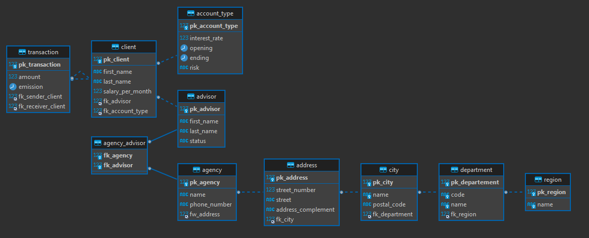

# Ma (première) DB

- Groupe G1
  - Arnaud BOYER
  - Clément LAFON
  - Clément LO-CASCIO

## TOC

- [Ma (première) DB](#ma--premi-re--db)
  * [TOC](#toc)
  * [But](#but)
    + [ERD](#erd)
  * [Indexes](#indexes)
    + [1 - Loan: opening](#1---loan--opening)
    + [2 - Advisor: status](#2---advisor--status)
    + [3 - Account: iban, swift](#3---account--iban--swift)
  * [Vues](#vues)
    + [1 - Comptes client](#1---comptes-client)
    + [2 - Montants client](#2---montants-client)
    + [3 - Agence client](#3---agence-client)
    + [4 -](#4--)
    + [5 -](#5--)
  * [Procédures stockées](#proc-dures-stock-es)
    + [1](#1)
    + [2](#2)

<small><i><a href='http://ecotrust-canada.github.io/markdown-toc/'>Table of contents generated with markdown-toc</a></i></small>


<br>


## But

Notre base représente une structure de banque simplifiée.

### ERD


<br>

## Indexes

### 1 - Loan: opening

Afin de pouvoir trier la table par date d'ouverture d'un crédit plus rapidement lors de calculs de temps.


### 2 - Advisor: status

Afin de pouvoir trier la table par états des employées. Pour retrouver plus rapidement les employées en service ou ceux en vacances par exemple.


### 3 - Account: iban, swift

Afin de pouvoir chercher plus rapidement les comptes lors de transactions inter-bancaires.

<br>

## Vues 

### 1 - Comptes client

Vue permettant d'afficher l'ensemble des comptes par clients.

```sql

```


### 2 - Montants client

Vue permettant d'afficher le total des montant des comptes par clients ainsi que des prêts et de l'épargne.

```sql
```


### 3 - Agence client

Vue permettant d'afficher les informations d'un client et de son/ses agences.

```sql
```


### 4 -


### 5 -

<br>

## Procédures stockées

### 1

Procédure permettant d'obtenir le total des actifs d'un client (comptes, prêts, épargnes).

```sql

```


### 2


